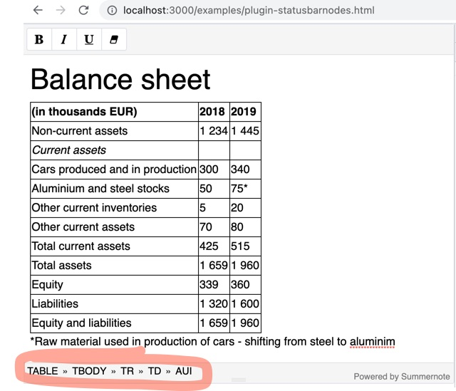

# summernote-statusbarnodes v0.1

A plugin for the [Summernote](https://github.com/summernote/summernote/) WYSIWYG editor.

summernote-statusbarnodes adds functionality that shows all parent nodes of selected node in the summernote status bar. The idea is to add the following functionality in a later step:

1. Selecting the nodes by clicking on the statusbar
2. Allowing to edit classes



## Installation

### 1. Include JS and CSS

Include the following code after Summernote:

```html
<script src="summernote-statusbarnodes.js"></script>
```

Include the following code after Summernote css.

```html
<link rel="stylesheet" href="../plugin/statusbarnodes/summernote-statusbarnodes.css">
```

### 2. Supported languages

Currently available in English!

### 3. Options

None at this time. This is work in progress, feel free to contribute!

### 4. Check out our other Summernote Plugins via summernote main Github page

- [Diemen Design](https://github.com/DiemenDesign/)
